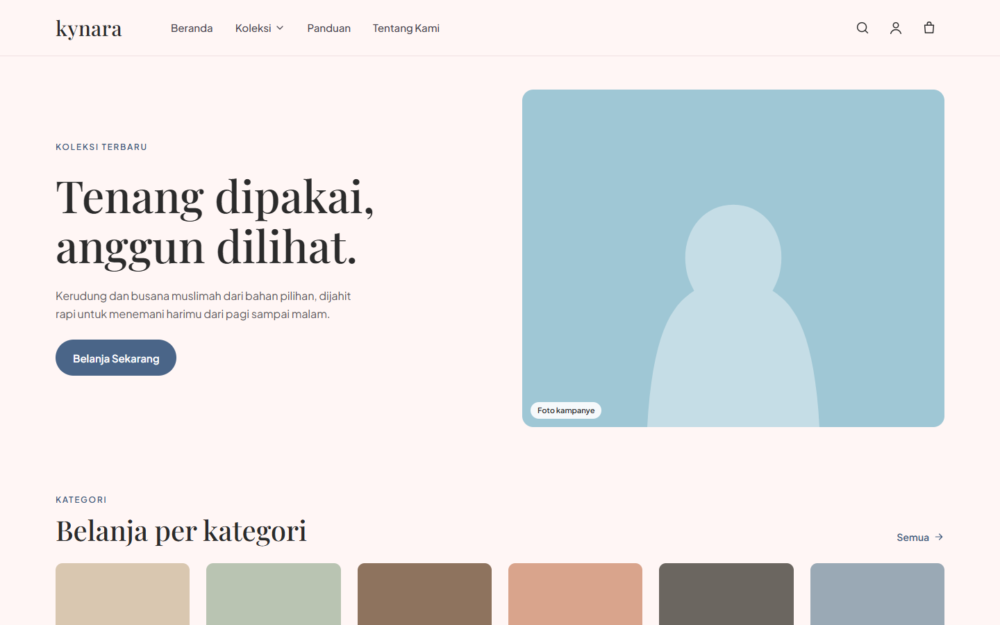
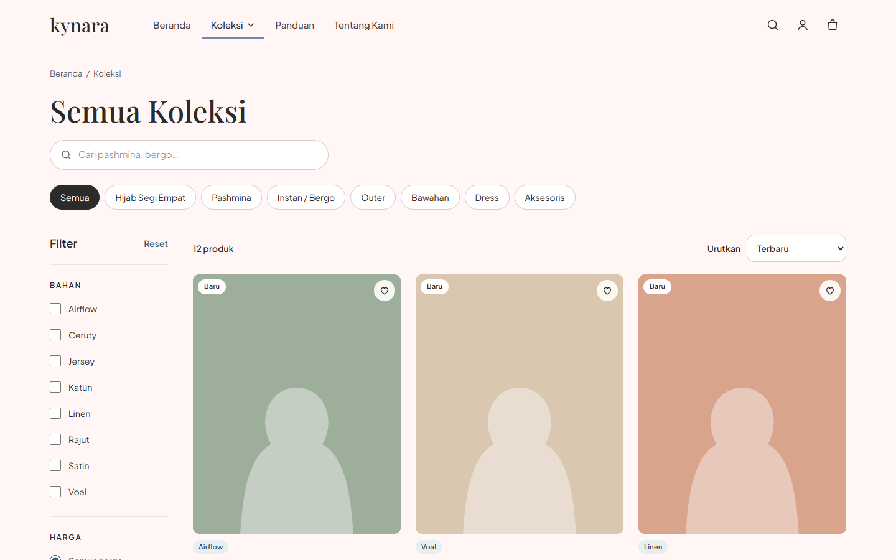
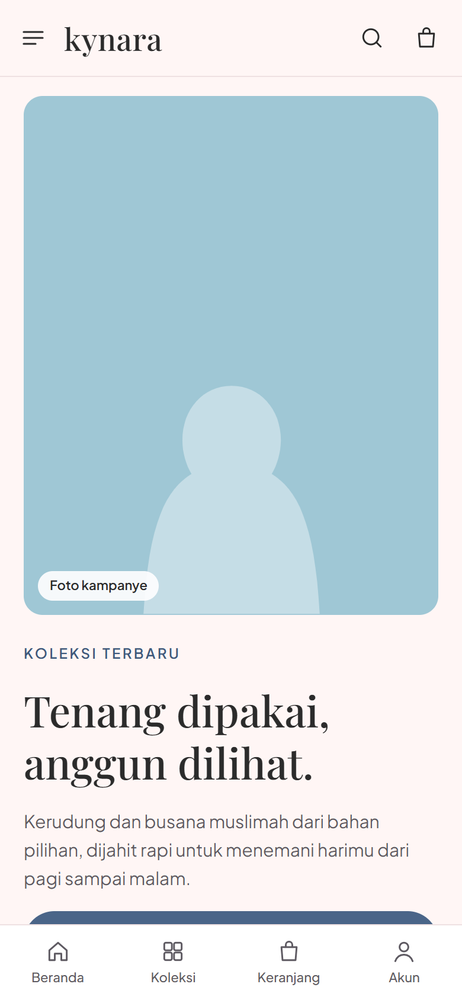
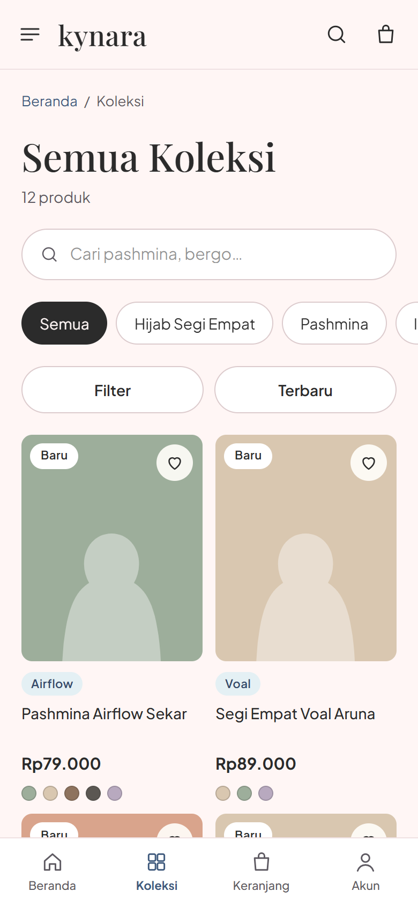
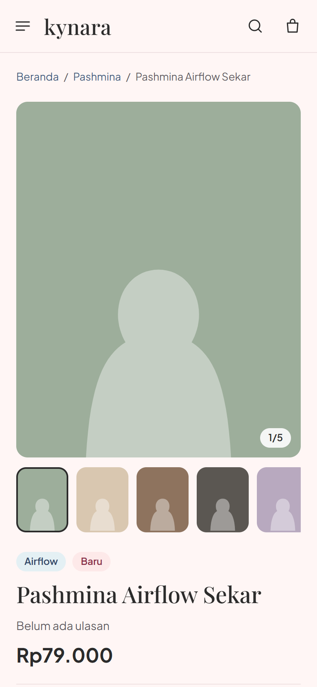

# kynara — Online Store for Hijab & Muslim Fashion

**English** · [Bahasa Indonesia](#bahasa-indonesia)

**kynara** is a full-stack e-commerce site for a hijab and muslimah fashion brand, built mobile-first for shoppers in Indonesia.
It is a portfolio project that is also being built to become a real, working store.

**Live demo:** [kynaraofficial.vercel.app](https://kynaraofficial.vercel.app). Payments run in **sandbox mode**, so no real money is charged. The user interface is in Indonesian.

| Home (desktop) | Collection (desktop) |
|---|---|
|  |  |

| Home (mobile) | Collection (mobile) | Product (mobile) |
|---|---|---|
|  |  |  |

*Product photos are placeholders until real photos are uploaded through the admin dashboard.*

---

## What it does

**For shoppers**
- **Catalog:** categories, products with color × size variants, and stock and price per variant.
- **Collection page:** filter by category, material, price range, and color, with sorting, search, and pagination. Filters live in the URL, so any result can be bookmarked or shared.
- **Product page:** gallery, color and size picker with live stock ("Only 3 left"), reviews summary, and related products.
- **Accounts:** sign up and log in with email or Google, password reset, profile, address book, and wishlist.
- **Cart:** works for guests (saved in the browser) and merges into the account cart after login.
- **3-step checkout:** address, courier, payment. Shipping costs come from RajaOngkir, with a flat-rate fallback when the API is unavailable.
- **Online payments:** virtual account and QRIS through Komerce Payment, with an order status timeline and countdown.

**For the store owner (admin dashboard)**
- Sales summary, orders to ship, and low-stock alerts.
- Order management: status updates with tracking numbers, status history, and CSV export.
- Products (variants, stock, photos), categories, and home page banners.

## Tech stack

| Layer | Tools |
|---|---|
| Frontend | [Next.js 16](https://nextjs.org) (App Router, Server Components), TypeScript, [Tailwind CSS v4](https://tailwindcss.com) |
| Backend & data | [Supabase](https://supabase.com): PostgreSQL, Auth, Storage, Row Level Security |
| Validation | [Zod](https://zod.dev) |
| Payments | [Komerce Payment API](https://rajaongkir.com/docs/payment-api/getting-started/getting-started): virtual account + QRIS (sandbox) |
| Shipping rates | [RajaOngkir](https://rajaongkir.com) (Komerce) free plan, cached in Postgres, flat-rate fallback |
| Testing | [Vitest](https://vitest.dev): unit tests, plus database tests against a real Supabase project |
| Hosting | Vercel (Singapore region, next to the database) + Supabase (free tiers) |

No paid libraries. UI icons are inline SVGs taken from the design files.

## Security by design

These rules were part of the project from day one, and were checked again in a full audit at the end ([report, in Indonesian](docs/audit-keamanan.md)):

- **Row Level Security on every table.** Visitors can only read the public catalog. Users can only see their own addresses, carts, and orders. Only admins can change products. Access is granted table by table, so new tables are not exposed by default.
- **Users cannot promote themselves.** The `role` column is not writable from the browser (column-level privileges).
- **Prices are never trusted from the browser.** Order totals and shipping costs are recalculated on the server from the database.
- **Atomic stock updates.** Stock is reduced inside one database transaction when an order is created, and returned when a payment expires.
- **Verified payment webhooks.** Payment callbacks are accepted only with a valid HMAC-SHA256 signature, and the status is re-checked with the payment API before anything changes.
- **All input validated with Zod**, including URL query parameters, and rate limits on login and checkout.
- **Integrity rules in the database:** stock can't go negative, totals must equal subtotal + shipping, and an order can't be marked "shipped" without a tracking number.
- **Security headers:** clickjacking protection, `nosniff`, strict referrer policy, and HSTS.

## SEO, performance & accessibility

- Unique title and description per page, Open Graph previews (product photo when available), canonical URLs, `sitemap.xml`, and `robots.txt`. Account, cart, checkout, and admin pages are marked `noindex`.
- Catalog and product pages are cached and refreshed every 60 seconds (ISR). Server functions run in the same region as the database.
- All images go through `next/image` (resized, modern formats, lazy-loaded below the fold).
- Lighthouse accessibility score of 100 on the store pages: labeled forms, color contrast checked against WCAG AA, visible keyboard focus, and a "skip to content" link.

**Lighthouse (mobile)**, measured against the live demo after Phase 8. The performance score is the median of 5 runs:

| Page | Performance | Accessibility | Best practices | SEO |
|---|---|---|---|---|
| Home | 80 | 100 | 100 | 100 |
| Collection | 87 | 100 | 100 | 100 |
| Product | 85 | 100 | 100 | 100 |

Before Phase 8, the collection page scored 64. The main fixes were moving server functions next to the database (time to first byte dropped from about 1.1 s to 0.2 s), caching product pages, and cutting the JavaScript sent on first load from about 344 KB to 210 KB (gzip).

## Project structure

```
src/
  app/
    (toko)/            Store: home, collection, product, cart, account, content pages
    (auth)/            Login, sign up, password reset
    (checkout)/        3-step checkout
    admin/             Admin dashboard
    api/               Payment callback, region lookup
  components/          UI by feature (catalog, product, cart, checkout, admin, ...) + reusable ui/
  lib/                 Data access, validation (Zod), payments, shipping, cart math
  types/database.ts    Types generated from the Supabase schema
supabase/
  migrations/          Database schema, RLS policies, functions (SQL)
  seed.sql             Sample categories & products
design-handoff/        Visual reference from the design phase (screens + extracted source)
docs/                  Build plan, deployment guide, security audit (Indonesian)
```

## Running it locally

**Requirements:** Node.js 20.9+ and a free [Supabase](https://supabase.com) project.

```bash
git clone https://github.com/Rzkyyy-cpu/kynara-official.git
cd kynara-official
npm install

# 1. Environment variables
cp .env.example .env.local        # then fill in the values (see the table below)

# 2. Database: link your project, then create the tables, policies, and sample data
npx supabase login
npx supabase link --project-ref <your-project-ref>
npx supabase db push --include-seed

# 3. Start the dev server
npm run dev                       # http://localhost:3000
```

Deploying to Vercel (and the Supabase, Google, and payment settings that go with it) is described step by step in [docs/deploy.md](docs/deploy.md).

### Environment variables

| Variable | Where it's used | Secret? |
|---|---|---|
| `NEXT_PUBLIC_SITE_URL` | Base URL of the site (auth emails, sitemap, link previews) | No |
| `NEXT_PUBLIC_SUPABASE_URL` | Supabase project URL | No |
| `NEXT_PUBLIC_SUPABASE_PUBLISHABLE_KEY` | Supabase publishable key (browser-safe, protected by RLS) | No |
| `SUPABASE_SECRET_KEY` | Server-only Supabase key (bypasses RLS) | **Yes** |
| `KOMERCE_PAYMENT_API_KEY` | Komerce Payment API key | **Yes** |
| `KOMERCE_CALLBACK_KEY` | Self-generated secret used to sign payment callbacks (HMAC) | **Yes** |
| `KOMERCE_IS_PRODUCTION` | `false` for sandbox | No |
| `RAJAONGKIR_API_KEY` | RajaOngkir (Shipping Cost) API key | **Yes** |
| `RAJAONGKIR_ORIGIN_ID` | RajaOngkir location ID of the shipping origin | No |
| `TEST_SUPABASE_URL`, `TEST_SUPABASE_PUBLISHABLE_KEY`, `TEST_SUPABASE_SECRET_KEY` | Optional: a separate Supabase project for `npm run test:db` | **Yes** (secret key) |

Secrets live only in `.env.local` (git-ignored) and in the hosting provider's settings. They are never committed.

### Scripts

| Command | What it does |
|---|---|
| `npm run dev` | Start the development server |
| `npm run build` / `npm start` | Production build / serve it |
| `npm run lint` | Lint with ESLint |
| `npm test` | Unit tests (cart totals, stock, webhook signatures, validation, ...) |
| `npm run test:db` | Database tests: RLS, atomic orders, payments (needs a Supabase project) |
| `npm run db:types` | Regenerate TypeScript types from the linked Supabase schema |

## Free-tier limits

The demo runs entirely on free plans, which comes with two caveats:
- **Supabase Free** pauses a project after about a week without activity. If the demo shows a database error, the project needs to be resumed from the Supabase dashboard.
- **Vercel Hobby** is for non-commercial use only. Before the store starts selling for real, it will move to a paid plan (Vercel Pro or another host) with its own domain, and payments will switch from sandbox to production.

## Roadmap

- [x] **Phase 1:** Project setup, design tokens, layout
- [x] **Phase 2:** Database schema + RLS, seed data, collection & product pages
- [x] **Phase 3:** Auth (email, Google, password reset), account pages, address book, wishlist
- [x] **Phase 4:** Cart (guest + logged in), 3-step checkout, server-side order creation with atomic stock
- [x] **Phase 4B:** Static content pages, first deployment
- [x] **Phase 5:** Online payments (virtual account + QRIS), verified callbacks, order status timeline
- [x] **Phase 6:** Real shipping rates (RajaOngkir) with caching and flat-rate fallback
- [x] **Phase 7:** Admin dashboard (summary, orders, products, categories, banners)
- [x] **Phase 8:** Security audit, SEO, performance, accessibility

The detailed plan (in Indonesian) is in [docs/rencana-fase.md](docs/rencana-fase.md).

## Design

The visual design (48 screens for mobile and desktop, plus a component and state sheet) was made before development and lives in [`design-handoff/`](design-handoff/).
The colors and type scale are defined as Tailwind theme tokens in [`src/app/globals.css`](src/app/globals.css).

## License

**All rights reserved.** The source is public so it can be read as a portfolio piece. The *kynara* name, brand, and design are not licensed for reuse.

## Author

**Muhamad Rizky Pratama**, informatics student learning full-stack development · GitHub [@Rzkyyy-cpu](https://github.com/Rzkyyy-cpu)

---

## Bahasa Indonesia

**kynara** adalah toko online full-stack untuk brand kerudung dan fashion muslimah. Dirancang mobile-first untuk pembeli di Indonesia.
Proyek ini adalah portofolio yang sekaligus disiapkan untuk menjadi toko sungguhan.

**Demo:** [kynaraofficial.vercel.app](https://kynaraofficial.vercel.app). Pembayaran memakai **mode sandbox**, jadi tidak ada uang sungguhan yang ditarik.

### Fitur

**Untuk pembeli**
- **Katalog:** kategori, produk dengan varian warna × ukuran, serta stok dan harga per varian.
- **Halaman Koleksi:** filter kategori, bahan, rentang harga, dan warna, ditambah urutan, pencarian, dan pagination. Filter tersimpan di URL, jadi hasilnya bisa di-bookmark atau dibagikan.
- **Halaman Produk:** galeri, pilihan warna dan ukuran dengan stok langsung ("Sisa 3 pcs"), ringkasan ulasan, dan produk terkait.
- **Akun:** daftar dan masuk dengan email atau Google, reset password, profil, buku alamat, dan wishlist.
- **Keranjang:** bisa dipakai tamu (tersimpan di browser) dan digabung ke keranjang akun setelah login.
- **Checkout 3 langkah:** alamat, kurir, pembayaran. Ongkir dari RajaOngkir, dengan tarif flat cadangan kalau API sedang bermasalah.
- **Pembayaran online:** virtual account dan QRIS lewat Komerce Payment, lengkap dengan timeline status pesanan dan hitung mundur.

**Untuk pemilik toko (dashboard admin)**
- Ringkasan penjualan, pesanan yang perlu dikirim, dan peringatan stok menipis.
- Kelola pesanan: ubah status dengan nomor resi, riwayat status, dan ekspor CSV.
- Kelola produk (varian, stok, foto), kategori, dan banner beranda.

### Teknologi

Next.js 16 (App Router), TypeScript, Tailwind CSS v4, Supabase (PostgreSQL, Auth, Storage, Row Level Security), Zod, Komerce Payment API (VA + QRIS, sandbox), RajaOngkir, Vitest. Hosting di Vercel (region Singapura, dekat database) + Supabase, semuanya paket gratis. Tanpa library berbayar.

### Keamanan sejak awal

Aturan ini dipasang sejak awal, lalu diperiksa ulang dalam audit menyeluruh di akhir ([laporan audit](docs/audit-keamanan.md)):

- **Row Level Security di semua tabel.** Pengunjung hanya bisa membaca katalog publik. User hanya melihat alamat, keranjang, dan pesanannya sendiri. Hanya admin yang bisa mengubah produk. Akses tabel diberikan satu per satu (tabel baru tidak otomatis terbuka).
- **User tidak bisa menjadikan dirinya admin.** Kolom `role` tidak bisa diubah dari browser.
- **Harga tidak pernah dipercaya dari browser.** Total pesanan dan ongkir dihitung ulang di server dari database.
- **Pengurangan stok atomik** dalam satu transaksi database, dan stok dikembalikan kalau pembayaran kedaluwarsa.
- **Webhook pembayaran terverifikasi.** Callback hanya diterima dengan signature HMAC-SHA256 yang valid, dan statusnya dicek ulang ke API pembayaran sebelum pesanan diubah.
- **Semua input divalidasi Zod**, termasuk parameter URL, ditambah rate limit di login dan checkout.
- **Aturan integritas di database:** stok tidak bisa minus, total harus sama dengan subtotal + ongkir, dan pesanan tidak bisa berstatus "dikirim" tanpa nomor resi.
- **Header keamanan:** perlindungan clickjacking, `nosniff`, referrer policy ketat, dan HSTS.

### SEO, performa & aksesibilitas

- Title dan description unik per halaman, pratinjau Open Graph (foto produk kalau ada), URL kanonik, `sitemap.xml`, dan `robots.txt`. Halaman akun, keranjang, checkout, dan admin diberi `noindex`.
- Halaman katalog dan produk di-cache dan diperbarui tiap 60 detik (ISR). Fungsi server berjalan di region yang sama dengan database.
- Semua gambar lewat `next/image` (diperkecil, format modern, lazy-load di bawah layar).
- Skor aksesibilitas Lighthouse 100 di halaman toko: form berlabel, kontras warna dicek terhadap WCAG AA, fokus keyboard terlihat, dan link "Langsung ke konten".

**Lighthouse (mobile)**, diukur ke demo setelah Fase 8. Skor performa adalah median dari 5 kali pengukuran:

| Halaman | Performa | Aksesibilitas | Best practices | SEO |
|---|---|---|---|---|
| Beranda | 80 | 100 | 100 | 100 |
| Koleksi | 87 | 100 | 100 | 100 |
| Produk | 85 | 100 | 100 | 100 |

Sebelum Fase 8, skor halaman Koleksi 64. Perbaikan utamanya: fungsi server dipindah ke region yang sama dengan database (waktu respons pertama turun dari ±1,1 dtk ke 0,2 dtk), halaman produk di-cache, dan JavaScript awal dipangkas dari ±344 KB ke 210 KB (gzip).

### Menjalankan di komputer sendiri

**Kebutuhan:** Node.js 20.9+ dan project [Supabase](https://supabase.com) gratis.

```bash
git clone https://github.com/Rzkyyy-cpu/kynara-official.git
cd kynara-official
npm install

# 1. Environment variable
cp .env.example .env.local        # lalu isi nilainya (lihat tabel versi Inggris di atas)

# 2. Database: hubungkan project, lalu buat tabel, policy, dan data contoh
npx supabase login
npx supabase link --project-ref <project-ref-kamu>
npx supabase db push --include-seed

# 3. Jalankan server development
npm run dev                       # http://localhost:3000
```

Langkah deploy ke Vercel ada di [docs/deploy.md](docs/deploy.md). Kunci rahasia (`SUPABASE_SECRET_KEY`, `KOMERCE_PAYMENT_API_KEY`, `KOMERCE_CALLBACK_KEY`, `RAJAONGKIR_API_KEY`, `TEST_SUPABASE_SECRET_KEY`) hanya disimpan di `.env.local` (diabaikan git) dan di pengaturan hosting. Kunci tersebut tidak pernah di-commit.

### Batas paket gratis

- **Supabase Free** menghentikan sementara (pause) project yang tidak aktif sekitar seminggu. Kalau demo menampilkan error database, project perlu diaktifkan lagi dari dashboard Supabase.
- **Vercel Hobby** hanya untuk pemakaian non-komersial. Sebelum toko mulai jualan sungguhan, hosting pindah ke paket berbayar (Vercel Pro atau hosting lain) dengan domain sendiri, dan pembayaran pindah dari sandbox ke production.

### Roadmap

- [x] **Fase 1:** Setup proyek, token desain, layout
- [x] **Fase 2:** Skema database + RLS, data contoh, halaman Koleksi & Produk
- [x] **Fase 3:** Auth (email, Google, reset password), halaman akun, buku alamat, wishlist
- [x] **Fase 4:** Keranjang (tamu + login), checkout 3 langkah, pembuatan pesanan di server dengan stok atomik
- [x] **Fase 4B:** Halaman konten statis, deploy pertama
- [x] **Fase 5:** Pembayaran online (VA + QRIS), callback terverifikasi, timeline status pesanan
- [x] **Fase 6:** Ongkir RajaOngkir dengan cache dan cadangan tarif flat
- [x] **Fase 7:** Dashboard admin (ringkasan, pesanan, produk, kategori, banner)
- [x] **Fase 8:** Audit keamanan, SEO, performa, aksesibilitas

Rencana lengkapnya ada di [docs/rencana-fase.md](docs/rencana-fase.md).

### Lisensi

**Hak cipta dilindungi.** Kode dibuka untuk publik sebagai portofolio. Nama, brand, dan desain *kynara* tidak boleh dipakai ulang.
